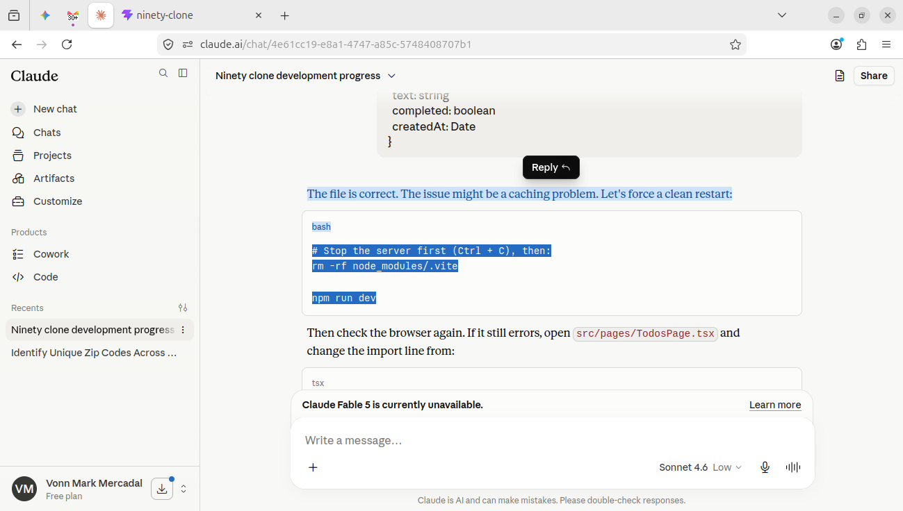

Vonn OS

Vonn OS is a high-performance productivity workspace designed for streamlined business management. Built to help individuals and teams track their essential business metrics, hit quarterly objectives, and manage daily tasks with absolute clarity.
🚀 Key Features

    Executive Dashboard: A centralized overview of your entire business health at a glance.

    Tasks (To-Dos): Actionable item tracking to ensure daily progress.

    Objectives (Rocks): Quarterly goal management to keep the big picture in focus.

    Vitals (Issues): An "IDS" (Identify, Discuss, Solve) module for surfacing and resolving roadblocks.

    Metrics (Scorecard): Weekly KPI tracking to measure what matters most.

🛠️ Tech Stack

    Core: React + TypeScript

    Build Tool: Vite

    Styling: Tailwind CSS

    Icons: Lucide React

    Deployment: Vercel

⚙️ Getting Started
Prerequisites

    Node.js (v20 or higher recommended)

    npm or pnpm

Installation

    Clone the repository:
    Bash

    git clone https://github.com/YOUR_USERNAME/vonn-os.git

    Navigate to the project directory:
    Bash

    cd vonn-os

    Install dependencies:
    Bash

    npm install

    Start the development server:
    Bash

    npm run dev

🚀 Deployment

Vonn OS is optimized for deployment via Vercel. To deploy your own instance:

    Push your code to a GitHub repository.

    Connect your repository to Vercel.

    Vercel will automatically detect the Vite build configuration and deploy your production build.

📝 License

This project is proprietary and built by Vonn Mercadal.